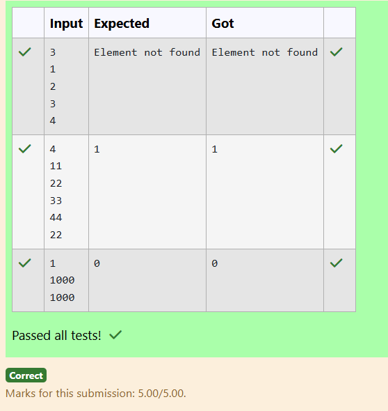

### Ex.No:1(D) ARRAYS
#### QUESTION:
Write a Java program to find the index of a given element in an array

### AIM:
To write a Java program that reads an array of integers and finds the index of a given element within the array.
### ALGORITHM :
1.Start the program and read the size of the array n.

2.Read n integer elements and store them in the array a[ ].

3.Read the element x whose index needs to be found.

4.Traverse the array from index 0 to n-1:

 If a[i] == x, print the index i and terminate the program.

5.If the loop finishes without a match, print "Element not found".

6.End the program.
### PROGRAM:
/*
Program to implement variables and Operators using Java
Developed by: Jothikrishnaa V
RegisterNumber: 212223100017
*/

#### Sourcecode.java:
```java
import java.util.Scanner;

public class Main {
    public static void main(String[] args) {
        Scanner sc = new Scanner(System.in);
        int n = sc.nextInt();
        int a[] = new int[n];
        for (int i = 0; i < n; i++) 
        {
        a[i] = sc.nextInt();
        }
        
        int x = sc.nextInt();
        for (int i = 0; i < n; i++) {
            if (a[i] == x) {
                System.out.println(i);
                return;
            }
            
        }
        System.out.println("Element not found");
        
    }
}
``` 
### OUTPUT:

### RESULT:
Therefore the program has been executed successfully.