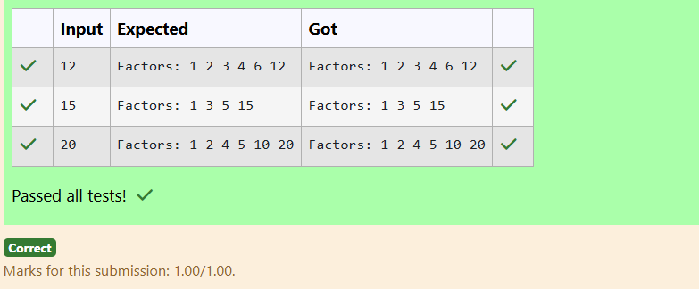

### Ex.No:1(C) LOOPING STATEMENT
#### QUESTION:
Display Factors of a Number

### AIM:
To write a Java program that reads an integer from the user and displays all the factors of the given number.
### ALGORITHM :
1. Start the program and read an integer n from the user.

2. Loop from 1 to n and check if each number i divides n exactly (i.e., n % i == 0).

3. If yes, print i as a factor.

4. Continue the loop until all factors are printed.

5. End the program.
### PROGRAM:
/*
Program to implement variables and Operators using Java
Developed by: Jothikrishnaa V
RegisterNumber: 212223100017
*/

#### Sourcecode.java:
```java
import java.util.Scanner;

public class Factors {
    public static void main(String[] args) {
        Scanner sc = new Scanner(System.in);
        int n = sc.nextInt();

        System.out.print("Factors: ");
        for (int i = 1; i <= n; i++) {
            if (n % i == 0) { 
                System.out.print(i + " ");
            }
        }
    }
}
``` 
### OUTPUT:

### RESULT:
Therefore the program has been executed successfully.